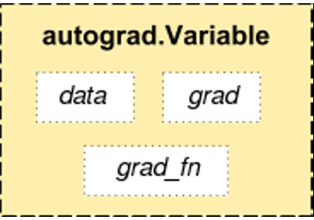

# Autograd & Variable

> - pytorch에서 연산을 위한 변수는 모두 Tensor로 선언되어 있어야 한다.
> - Autograd 기능을 이용하면 Backdrop을 자동으로 수행시킬 수 있다.
> - 그를 위해서는 Backdrop 계산을 해야하는 Tensor 형태의 변수를 Variable로 감싸야한다.
> - Pytorch에서 제공하는 nn과 nn.functional을 이용하면 다양한 Neural Network를 위한 함수를 쉽게 사용할 수 있다.
> - nn과 nn.functional의 차이를 알고 쓰는 것이 좋다

## Autograd

>Automatic differentiation

- autograd를 사용하면 backdrop을 위한 미분 값을 자동으로 계산해줌
- 자동 계산을 위해서 사용하는 변수는 torch.autograd에 있는 Variable


### Variable

```python
import torch
from torch.autograd import Variable

a = torch.rand(5)
a = Variable(a)
```




- data:  tensor 형태의 데이터가 담김
- grad: Data가 거쳐온 layer에 대한 미분값이 축적됨
- grad_fn: 미분 값을 계산한 함수에 대한 정보


```python
import torch
from torch.autograd import Variable

a=torch.ones(2,2)
print(a)
"""
1 1
1 1
"""

a=Variable(a, requires_grad=True)
print(a)
"""
Variable containing:
1 1
1 1
"""

a.data
"""
1 1
1 1
"""

a.grad
"""
None
"""

a.grad_fn
"""
None
"""

b=a+2
print(b)
"""
Variable containing:
3 3
3 3
"""

c=b**2
print(c)
"""
Variable containing:
9 9
9 9
"""

out = c.sum()
print(out)
"""
36
"""

out.backward()
a.data
"""
1 1
1 1
"""

a.grad
"""
6 6
6 6
"""

a.grad_fn
"""
None
"""

b.data
"""
3 3
3 3
"""

b.grad
"""
None
"""

b.grad_fn
"""
<AddBackward0 object at ...>
"""

c.data
"""
9 9 
9 9 
"""

b.grad
"""
None
"""

b.grad_fn
"""
<PowBackward0 object at ...>
"""

c.data
"""
36
"""

c.grad
"""
None
"""

c.grad_fn
"""
<SumBackward0 object at ...>
"""
```


### 요약

```python
x=torch.ones(3)
x=Variable(x, requires_grad=True)
y=(x**2)
z= y*3
print(z)
"""
Variable containing:
3
3
3
"""

grad=torch.Tensor([0.1, 1, 10])
z.backward(grad)

x.data
"""
1
1
1
"""

x.grad
"""
Variable containing:
0.6000
6.0000
60.0000
"""

x.grad_fn
"""
None
"""
```

