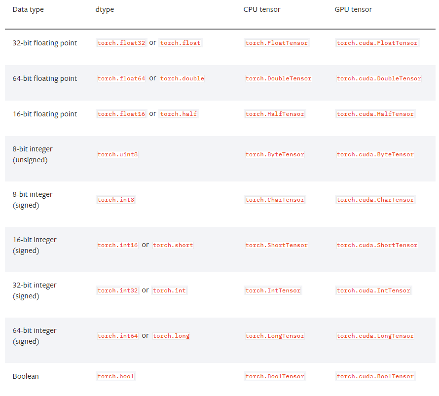

# Pytorch_Tensor

> 파이썬의 딥러닝 프레임워크


### Tensors

- pytorch의 자료형

- 단일 데이터 타입으로 된 자료돌의 다차원 행렬

- 간단한 명령어를 통해서 GPU로 연산을 수행하게 만들 수 있음

  => Tensor 변수 뒤에 .cuda() 추가


### Tensors 종류

> 그냥 Tensor로 선언하면 자동으로 `FloatTensor`





### Torch의 선언

`torch.Tensor(크기)`

=> 초기화되지 않은 Tensor 생성

```python
import torch
x = torch.Tensor(3)
x

# tensor([-3.4064e-16,  4.5911e-41, -3.4064e-16])

x2 = torch.Tensor(3, 3)
x2

#tensor([[0., 0., 0.],
#        [0., 0., 0.],
#        [0., 0., 0.]])
```


### Tensor의 random 선언

```python
# rand를 통한 a는 0에서 1사이의 uniform distribution random 값으로 선언
a = torch.rand(3,3)
a

#tensor([[0.5317, 0.7687, 0.2670],
#       [0.2938, 0.9862, 0.4481],
#       [0.7473, 0.1439, 0.7315]])
```


```python
# randn을 통한 a2는 평균이 0이고 분산이 1인 normal distribution random값으로 선언

a2 = torch.randn(3,3)
a2

#tensor([[-1.8723,  1.1849,  0.4376],
#       [-0.3300,  1.2719,  0.5767],
#       [ 1.1441,  0.7258,  0.6646]])

```


### Numpy에서 Tensor로

```python
import numpy as np
a = np.array([1,2,3,4])
b = torch.Tensor(a)

# a
# array([1, 2, 3, 4])

# b
# tensor([1., 2., 3., 4.])
```


### Tensor에서 Numpy로

```python
a = torch.rand(3,3)
b = a.numpy()

# a
# tensor([[0.0129, 0.9387, 0.5999],
#        [0.8648, 0.2818, 0.6280],
#        [0.3703, 0.5967, 0.0710]])

# b
# array([[0.01285189, 0.93868333, 0.59987557],
#       [0.86482924, 0.28180724, 0.6279522 ],
#       [0.3703392 , 0.5966974 , 0.07095754]], dtype=float32)
```


### Tensor의 형태 변환(view)

```python
a = torch.rand(3,3)
a = a.view(1,1,3,3)
a

# tensor([[[[0.9847, 0.2649, 0.6583],
#          [0.6269, 0.1797, 0.7883],
#          [0.8125, 0.6146, 0.2601]]]])
```


### Tensor 합치기

- `torch.cat((Tensor_A, Tensor_B), dim)`

  => Tensor_A와 Tensor_B를 dim에 맞춰서 합쳐준다

  ```python
  a = torch.randn(1,1,3,3)
  b = torch.randn(1,1,3,3)
  c = torch.cat((a,b),0)
  
  #c
  """
  tensor([[[[-0.0036, -1.6928, -0.5299],
            [-1.8354,  0.2300, -2.6085],
            [-1.4270, -0.4334,  1.2833]]],
  
  
          [[[-0.0902,  0.4488, -0.2411],
            [ 0.0520, -1.3521,  0.0201],
            [ 0.9012,  2.0614, -0.1110]]]])
  """
  ```

  

### Tensor 계산을 GPU로

```python
x = torch.rand(3,3)
y = torch.rand(3,3)
if torch.cuda.is_available():
    x = x.cuda()
    y = y.cuda()
    sum = x + y
```


### 