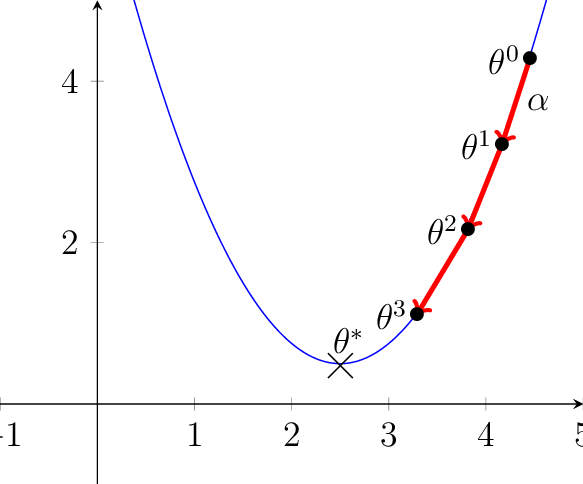
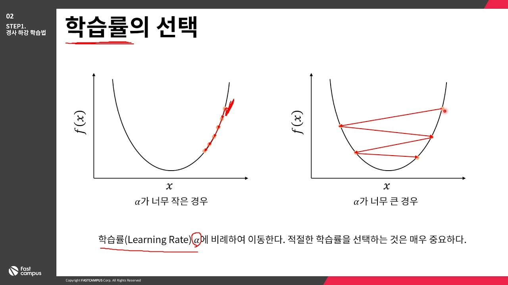
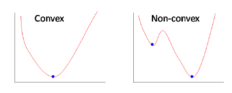
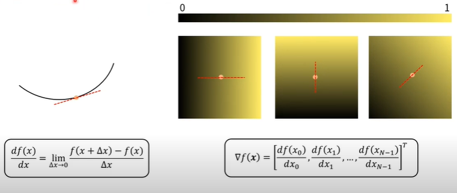
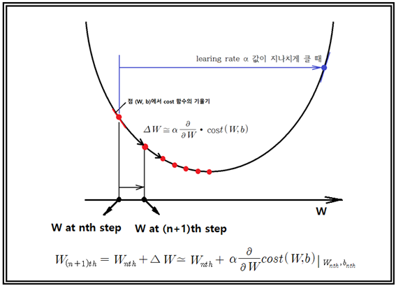

# 경사하강 학습법(Gradient Descent)

- 경사를 따라 여러 번의 스텝을 통해 최적점으로 다가간다.

- 경사는 기울기(미분, Gradient)를 이용해 계산한다.

  

### 학습률의 선택

- 학습률(Learning Rate)는 a에 비례하여 이동한다. 적절한 학습률을 선택하는 것은 무 중요하다.

  

### 볼록함수, Convex Function

- 볼록함수(Convex function)는 어디에서 시작하더라도 경사하강법으로 최적값에 도달할 수 있다.

  

### 비볼록함수, Non-Convex Function

- 비볼록함수는 시작위치에 따라 다른 최적 값을 찾는다. 즉 지엽 최적값(Local Minimum)에 빠질 위험이 있다.

## 수학

### 미분과 기울기

- 기울기(Gradient)는 스칼라는 벡터로 미분한 것이며, 벡터의 각 요소를 미분하면 된다.

  

### 경사하강법

- 경사 하강법은 f(x)의 값이 변하지 않을 때까지 스텝을 반복한다.

