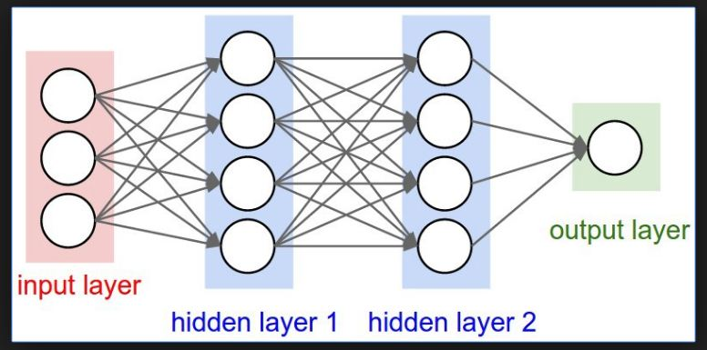

# 역전파(Backpropagation)


## Deep Neural Net




### 노드 학습

```python
class Node:
    def __init__(self):
        self.w = tf.Variable(tf.random.normal([2,1]))
        self.b = tf.Variable(tf.random.normal([1,1]))
        
    def __call__(self, x):
        # forward propagation
        out = tf.matmul(x, self.w)
        out = tf.add(out, self.b)
        out = tf.nn.sigmoid(out)
        return out
    
    def loss(self, y_pred, y):
        return tf.reduce_mean(tf.square(y_pred - y))
    
    def train(self, inputs, outputs, learning_rate):
        epochs = range(1000)
        for i, epoch in enumerate(epochs):
            with tf.GradientTape() as t:
                current_loss = self.loss(self.preds(inputs), outputs)
                if i % 1000 == 0:
                    print(str(i) + " epoch, loss: " + str(current_loss.numpy()))
                # back propagation
                dW, db = t.gradient(current_loss, (self.w, self.b))
                self.w.assign_sub(learning_rate + dW)
                self.b.assign_sub(learning_rate + db)
```


