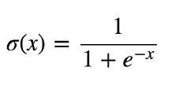
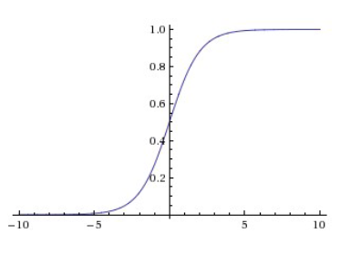
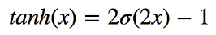
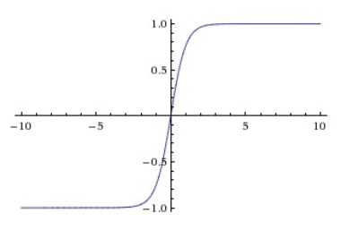
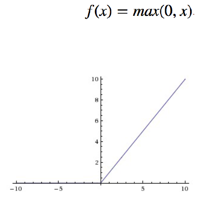

# 활성함수, Activation function

> 네트워크에 비선형성(non-linearity)을 추가하기 위해 사용

- 활성함수 없이 layer를 쌓은 네트워크는 1-layer 네트워크와 동일하기 때문에 활성함수는 비선형함수로 불리기도 한다.
- 멀티레이어 퍼셉트론을 만들 때 활성함수를 꼭 사용해야 한다

### 일반적인 뉴럴 네트워크 구조

- FC => 활성함수 => FC => 활성함수

  FC(Fully-Connected 레이어층)

  현재 레이어- 다음 레이어의 뉴런들이 전부 연결되어 있기 때문에 불리는 이름

  MLP(멀티 레이어 퍼셉트론)의 각 퍼셉트론 층과 같은 의미

## 시그모이드 함수, Sigmoid Function

- 결과 값이 0, 1 사이로 제한
- 뇌의 뉴런과 유사

### 문제점

- **gradient vanishing** 문제

  gradient에 0이 곱해져서 그 다음 layer로 전파되지 않음 => 학습 불가

- 활성함수 결과 값의 중심이 0이 아닌 0.5

- 지수함수 계산이 필요해서 계산이 복잡

### gradinet vanishing 문제 해결방안

- tahn

  - 결과값이 -1, 1사이로 제한 됨 => 중심값: 0
  - 나머지 특성은 시그모이드와 비슷, 시그모이드 함수를 이용해 유도 가능
  - 여전히 gradient vanishing 문제 발생

  

  

- ReLU, Rectified Linear Unit

  - 최근, 뉴럴 네트워크에서 가장 많이 쓰이는 활성 함수

  - 비선형 함수

  - 장점

    - 양 극단값이 포화되지 않는다.

      양수 지역은 선형적

    - 계산이 매우 효율적

      최대값 연산 1개

    - 수렴 속도가 시그모이드류 함수 대비 6배 빠름

  - 단점

    - 중심값이 0이 아님
    - 입력값이 음수인 경우 항상 0을 출력 => 학습 안됨

  

