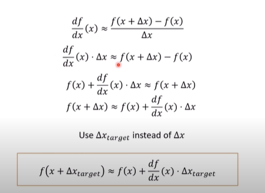
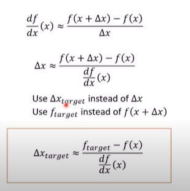

# Numerical Differentiation


```c
const float x = 1.0;
const float dx = 0.1;
const float df = getF(x + dx) - getF(x);
const float df_over_dx = df/dx;
```





```c
#include <iostream>

float getF(const float& x)
{
    const float a = 0.5;
    const float b = 0.1;
    
    return a * x + b;
}

void main()
{
    const float x = 1.0;
    const float dx = 0.1;
    const float dx_target = 0.2;
    
    const float df = getF(x+dx) - getF(x);
    const float dfdx = df / dx;
    
    const float f_new = getf(1.0) + dfdx * dx_target;
    
    std::cout << "f(1.2) = " << getF(x + dx_target) << std::endl;
    std::cout << "f(1) + dfdx * 0.2 =" << f_new << std::endl;
}
```





```c
#include <iostream>

float getF(const float& x)
{
    const float a = 0.5;
    const float b = 0.1;
    
    return a * x + b;
}

void main()
{
    const float x = 1.0;
    const float dx = 0.1;
    const float df = getF(x + dx) - getF(x);
    const float dfdx = df/dx;
    
    const float f_target = 0.7;
    const float dx_target = (f_target - getF(x)) / dfdx;
    
    std::cout << "f_target = " << f_target << std:endl;
    std::cout << "f(x + dx_target) = " << getF(x + dx_target) << std::endl;
}
```

