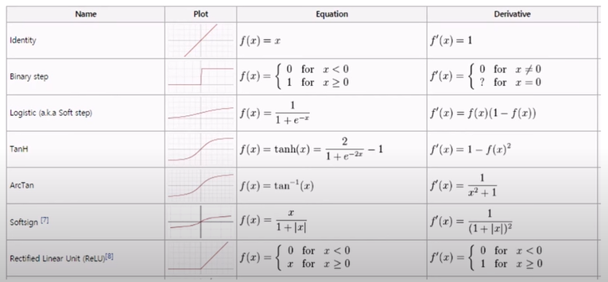

# 프로그래밍 미분


### 미분표




### Identity Function


```c
float getIdentity(const float& x) {
    return x;
}

float getGradIdentity(const float& x) {
    return 1.0;
}
```


### Sigmoid Function


```c
float getSigmoid(const float& x){
    return 1.0f / (1.0f + exp(-x));
}

float getGradSigmoid(const float& x){
    const float f = getSigmoid(x);
    return f * (1.0 - f);
}
```


### ReLU Function


```c
float getReLU(const float& x){
    return x >= 0.0f ? x : 0.0f;
}

float getGradReLU(const float& x){
    return x >= 0.0f ? 1.0f : 0.0f;
}
```

